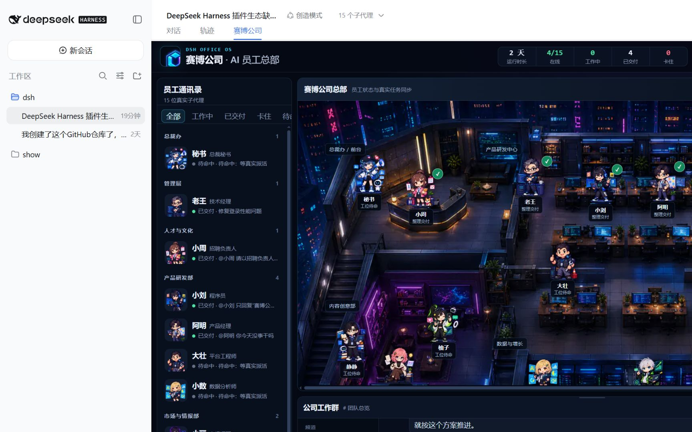

# 赛博公司 · DSH 多智能体工作台

> 在 DeepSeek Harness 当前会话中，把独立子代理、真实群聊、工具轨迹和可视化办公室合并成一个公司运营界面。



`dsh-org-panel` 是一个 DeepSeek Harness 插件。主 Agent 在界面中显示为“秘书”，明确 `@` 某位员工时，消息会直达该员工对应的独立子代理；多人讨论使用真实 `staff_meeting`，不会由秘书一人扮演全公司。

**配置速查**：可直接复制的完整示例见 [`cordis.example.yml`](./cordis.example.yml)，逐字段说明见 [`docs/CONFIG.md`](./docs/CONFIG.md)。
**先读一遍**：[已知边界](#已知边界)。这一节写的是本版**做不到**的事，配置之前看它比看功能列表更省时间。

## 工作台

- **员工通讯录**：按部门分组，支持状态筛选；单击员工会联动办公室和聊天，双击直接插入 `@员工`。
- **赛博公司总部**：单张 1200×720 WebP 场景承载完整空间，员工以独立 sprite 覆盖其上；工作、会议、卡住、交付和休息都有可解释状态。
- **公司工作群**：频道、老板消息、秘书回复、员工本人回复、多人会议、工具事件与安全执行摘要都来自当前 DSH 会话。
- **输入框**：使用 DSH 原生 Composer（面板内的 `[data-composer-seat]` 座位），本插件不自制输入控件、不隐藏也不替换官方输入框。
- **经营侧栏**：只展示真实任务、成长、技能与插件市场结果；成长/技能/插件使用单卡 Tab，不堆叠三块长面板。顶栏那个数字是「活跃/在册」，不是「在线」——本插件不持有员工进程、没有心跳，拿不到谁在线就不假装知道。
- **公司设置中心**：员工 / 模型 / 插件 / 通讯 / 安全 / 存储六页。拿不到真实数据时显示 `0` / `—` / `未知`，不用好看的默认值填充。
- **响应式布局**：桌面保留三栏；窄屏把员工通讯录和经营侧栏变成抽屉，办公室保持固定世界坐标并允许平移，不把 1200×720 强行缩成小图。

## 真实交互

```text
@老王 请检查本次发布的技术风险
@小刘 修复登录接口并回复验收结果
@阿明 @小周 围绕招聘需求开会，给出共同结论
```

- 未点名的统筹请求由秘书处理。
- 单独点名由对应员工本人回复。
- 多人讨论由 `staff_meeting` 让员工依次发言并形成结论。
- 页面只展示可公开的执行摘要和真实工具事件，不展示私有思维链。

## Host 工具清单

在真实 cordis Context 上装配成功后，会有 22 个工具进入 Tool Registry：

| 层 | 工具 |
| --- | --- |
| 员工核心 | `staff_chat`、`staff_meeting`、`staff_memory_recall`、`staff_memory_remember`、`staff_skill_learn`、`staff_reflect`、`staff_profile`、`staff_capability_scan`、`company_snapshot` |
| 社区市场 | `staff_plugin_market_search`（只披露，不安装） |
| 模型网关 | `vision_analyze`、`company_model_list`、`company_model_config`、`company_model_test`、`company_model_bind` |
| 插件运行时 | `staff_plugin_install_request`、`staff_plugin_install_apply`、`staff_plugin_verify`、`staff_plugin_health_check`、`staff_skill_evidence` |
| 外部通讯 | `company_comm_status`、`company_comm_send` |

模型网关 / 插件运行时 / 外部通讯这三层是可选层：某一层挂载失败不会拖垮整个插件，
缺的那层会如实写进 host 日志（`dsh-org-panel: <层名> 未能挂载，该能力本次运行不可用：…`），
对应的工具也不会出现在 Registry 里。
**如果你在设置里看到「模型 0 / 插件 0」，第一件事是去看 host 日志有没有这行 warn**，而不是怀疑前端。

`company_comm_status` / `company_comm_send` 即使一个渠道都没配也会注册 —— 前者会如实回「未配置」，
后者会拒绝发送，不会伪造已送达。

## 安装与配置

```bash
npm install dsh-org-panel
```

最小挂载（面板能亮，不启用任何外发能力）：

```yaml
- id: org-panel
  name: dsh-org-panel
  config:
    tabLabel: 赛博公司
    companyName: 赛博公司 · AI 员工总部
    chatEnabled: true
```

安装为 DSH bundle 时，`cordis.patch.yml` 会自动插入的就是上面这段。模型、插件预批准、飞书
都会带来真实的外发请求或安装动作，**不会**被默认补丁悄悄打开，需要自己按下面的段落加。

### 配一个视觉模型（本版唯一会真实发请求的模型能力）

```yaml
    models:
      vision-main:
        type: vision
        provider: openai-compatible       # 或 gemini / custom
        baseUrl: https://your-gateway.example.com/v1
        model: your-vision-model-name
        apiKeyRef: env:VISION_API_KEY     # 明文密钥会被当场拒绝
        enabled: true

    modelBindings:
      image-creator:                      # 员工 id
        vision: [vision-main]
```

配好后 `vision_analyze` 才有可用供应商；没配时员工会原样转达「我目前没有可用的图片理解模型」，
**不会**根据文件名或上下文脑补图片内容。

### 插件安装审批

```yaml
    pluginInstall:
      executor: auto        # auto / tool / none
      preapproved: []       # 写进这里的包名 = 老板本人的显式批准，会跳过 UI 审批
      probeHostApproval: false
```

流程是：员工 `staff_plugin_install_request`（只披露不安装）→ **人类批准** →
`staff_plugin_install_apply`（真实安装 + Capability Scan + Smoke Test）→ 通过才沉淀为技能。
安装命令只允许 `dsh` / `npm` / `pnpm` / `yarn` / `bun` 的 `add|install`，包标识只接受 npm 包名与
`github:owner/repo`；URL、tarball、`git+ssh:`、`file:`、本地路径一律拒绝。

### 外部通讯（飞书）

配置形状见 [`cordis.example.yml`](./cordis.example.yml) 第 6 段与 [`docs/CONFIG.md`](./docs/CONFIG.md) §8。
权限全部 fail-closed：`adapters[].enabled` 不写就是 `false`，权限档位不写就是 `read-only`，
名单外的人和群默认直接拒绝。

#### 飞书接入前置条件（插件之外还需要你自己做的事）

1. **长连接模式（`connectionMode: long-conn`）需要你自己安装官方 SDK**：

   ```bash
   npm install @larksuiteoapi/node-sdk
   ```

   本包**不依赖**它（不在 `dependencies` 里）。没装时会在日志里说明并自动降级到 webhook 模式。

2. **webhook 模式必须给端口**：`options.webhookPort`。不给端口时状态为 `degraded`，
   等宿主自己把 `feishuAdapter().handleEvent` 挂到已有 HTTP 服务上。

3. **webhook 模式必须能验真**：`credentials` 里至少要有 `verificationToken` 或 `encryptKey` 之一，
   否则**拒绝开端口**（宁可不连，也不开一个谁都能伪造老板身份的入口）。
   确需裸奔必须显式写 `options.allowUnverifiedEvents: true`。

4. **端口默认只绑 `127.0.0.1`**。要对外暴露必须显式写 `options.webhookHost`，
   并自己在前面加反向代理与鉴权 —— 代码只会在日志里警告一次，不会替你挡。

5. 飞书开放平台侧的应用创建、事件订阅地址填写、权限申请与发布审核，都需要你自己在飞书后台完成。

### 数据与密钥

默认落盘位置：

```text
~/.dsh-org-panel/evolution.json           员工记忆 / 技能 / 履历 / 模型绑定
~/.dsh-org-panel/company.json             公司档案 + 模型供应商
~/.dsh-org-panel/plugin-approvals.json    插件安装审批台账
~/.dsh-org-panel/secrets/credentials.enc  本地密钥库
~/.dsh-org-panel/attachments/             外部渠道附件
```

全部可用 `config` 字段或环境变量改写（`DSH_ORG_PANEL_MEMORY_FILE` 等，见 `docs/CONFIG.md` §3）。

密钥只接受 `env:XXX` / `secret:XXX` 引用，明文一律当场拒绝。
**本地密钥库默认只是「本机混淆」，不是真加密**：密钥材料只来自本机公开信息与同文件里的明文
salt，同机同用户可直接解密。设置 `DSH_ORG_PANEL_SECRETS_PASSPHRASE` 才升级为真正的口令加密。
UI 会如实显示这个等级，不会一律打绿标。

## 已知边界

这一节写的是本版**做不到**的事。都是照实说，不是路线图措辞。

| 边界 | 现状 |
| --- | --- |
| **只有 vision 模型会真的被调用** | `text` / `image` / `video` / `embedding` 供应商可以配、可以绑、会出现在 fallback 链里，但没有任何运行时消费它们。员工说话用的仍然是 DSH 自己的子代理模型，**配 text 供应商不会改变员工用哪个模型思考**。`company_model_test` 对非 vision 供应商只返回 `checked: 'config-only'` |
| **`secret:` 引用写不进去** | 本地密钥库有读路径，但没有任何工具或 UI 能往里写值。除非宿主提供 Secret Service，否则请统一用 `env:XXX` |
| **QQ / 微信是未实现的骨架** | 状态恒为 `degraded`，发送直接抛「尚未实现」。不伪造连接成功、不伪造消息 |
| **飞书长连接需要你自己装 SDK** | `@larksuiteoapi/node-sdk` 不是本包依赖；没装就只能走 webhook 模式，且 webhook 需要 `webhookPort` + 验真密钥 |
| **只读渠道不是预防式拦截** | 当前 DSH 子代理 API 不接受工具白名单参数，宿主无法在起子代理时剔除写工具。`read-only` 的真实保证是「提示词禁止 + 事后真实观测越权 → 回复不外发、记 `blocked`、发 `external.write.denied`、中止转交链」。**写可能已经发生，但结果被拦下且被记录** |
| **飞书事件不会推到浏览器** | `event-bus` 在 host 与 client 各有一份实例（两个 bundle），跨进程同步依赖 RPC 通道；面板里的通讯相关展示依赖工具返回值，不会自己实时亮起来 |
| **子代理内部的工具调用看不见** | 子代理内部的工具调用不进父会话 node 流。所以办公室小人不会显示「他现在在跑哪个工具、做到第几步」—— 拿不到就不显示，不编造活动 |
| **CI 不跑单元测试** | `.github/workflows/ci.yml` 只跑 `typecheck` / `build` / `size-check`。`node --test tests/*.test.mjs` 需要本地手动执行 |

## DSH 插件规范

项目使用 DSH 的标准插件声明：

| 位置 | 作用 |
| --- | --- |
| `package.json > dsh.bundle.patch` | profile bundle 的 Cordis composition 补丁 |
| `package.json > dsh.client` | Web Client 平台和所需注入服务 |
| `cordis.patch.yml` | 默认插入 `dsh-org-panel` composition row |
| `cordis.example.yml` | 手动挂载到 agent preset 的完整示例 |
| `src/index.ts` | Host 入口：员工核心 + 模型网关 + 插件运行时 + 外部通讯 |
| `src/client-v9/index.tsx` | 注册 `conversation.view` 的“赛博公司”Tab 与 `@` 候选源 |

Client 注入：

```json
{
  "inject": [
    "@deepseek-ai/dsh-client-runtime",
    "@deepseek-ai/dsh-client-ui-conversation",
    "@deepseek-ai/dsh-client-ui-input-trigger"
  ],
  "platform": "web"
}
```

Tab 注册方式：

```ts
slots.inject('conversation.view', () => slots.register(
  { name: 'conversation.view', id: 'realm', order: 20, label: () => normalized.tabLabel },
  (props: any) => createElement(CompanyView, Object.assign({}, props, { timer, config: normalized })),
))
```

如果启动时报错：

```text
profile bundle "dsh-org-panel" declares no dsh.bundle in its package.json
```

请确认 DSH 实际加载的安装包版本包含 `package.json` 中的 `dsh.bundle.patch`，并且 `cordis.patch.yml` 在 npm 包的 `files` 中；重新构建、安装并重启 DSH。只修改本地源码但不重建不会生效。

## 运行时资产管线

DSH 通过 `fetch + eval` 加载插件 Client，并不会稳定暴露 npm 包中的静态资源目录。因此运行时图片一律内联：

1. 高清原稿保存在 `design-assets/`，不会进入 npm 运行包。
2. `scripts/build-runtime-assets.mjs` 使用 `sharp` 生成 `src/runtime-assets/`：
   - 员工头像 `thumb.webp`：96×96
   - 办公室员工 `sprite.webp`：128×128
   - 员工档案 `profile.webp`：384×384
   - 办公室底图 `office-hq-base.webp`：1200×720
3. 构建脚本生成 `src/client-v9/generated-assets.ts`，以压缩 WebP data URL 作为稳定 fallback。
4. `AssetImage` 处理 loading / loaded / failed；单个资源失败时显示姓名缩写，不出现浏览器破图图标。

发布体积门禁：

- `lib/client.js` 必须小于 **3.5 MiB**。
- `npm pack` 必须小于 **4.5 MiB**。
- `npm run size-check` 本地和 CI 都会执行，超标直接失败。

参考值（2.0 本地构建）：`client.js 1.46 MiB`，`npm pack 1.14 MiB`。准确数字以 `npm run size-check` 的实际输出为准。

## 本地开发

```bash
npm ci
npm run typecheck
npm run build
npm run size-check
npm test            # build + node --test tests/*.test.mjs
npm pack --dry-run
```

构建产物：

- Host：`lib/index.js`
- Client：`lib/client.js`
- 类型：`lib/index.d.ts`、`lib/client.d.ts`

> `npm run build` 不会清空 `lib/`。改名或删除源文件后，旧的 `.d.ts` 会留在 `lib/` 里并被
> `npm publish` 一起发出去。删文件之后请手动清一次 `lib/`（或 `rm -rf lib && npm run build`）。

修改后需要重启 DSH，浏览器刷新才能加载新的 Client bundle。

## 目录结构

```text
dsh-org-panel/
├── design-assets/                 # 高清设计源，不进入 npm 包
├── docs/
│   ├── CONFIG.md                  # 配置逐字段参考
│   ├── EVOLUTION.md               # 员工自我进化机制
│   └── qa/                        # 1920 / 1440 / 1280 实机验收图
├── scripts/
│   ├── build-runtime-assets.mjs   # sharp WebP 与内联资产生成
│   └── check-size.mjs             # Client / npm 包体积门禁
├── src/
│   ├── index.ts / host-v2.ts / host-v3.ts   # Host 装配
│   ├── capabilities/              # 插件运行时（申请→审批→安装→验证）、技能证据
│   ├── models/                    # 模型网关 + 三个供应商适配器
│   ├── integrations/im/           # IM Gateway / Router / 飞书·QQ·微信 Adapter
│   ├── persistence/               # EvolutionStore / CompanyStore / 迁移
│   ├── runtime/                   # 公司事件总线与事件归约
│   ├── runtime-assets/            # WebP 运行时资产
│   ├── client.tsx                 # Client 入口（只指向 client-v9）
│   └── client-v9/
│       ├── components/            # Header / Roster / Office / Chat / Rail
│       ├── settings/              # 公司设置中心六页
│       ├── employee-profile/      # 员工档案弹窗
│       ├── company-view.tsx       # 当前 Tab 工作台
│       ├── messages.ts            # 真实会话消息映射
│       └── selectors.ts           # 真实任务、员工、频道与办公室状态
├── tests/                         # node:test 回归用例
├── cordis.patch.yml
├── cordis.example.yml
└── package.json
```

## 验收截图

以下为 v1.4 工作台的实机截图，用于布局与响应式验收（2.0 新增的设置中心不在这几张图里）：

- [1920×1080](./docs/qa/cyber-company-v1.4-1920x1080.png)
- [1440×900](./docs/qa/cyber-company-v1.4-1440x900.png)
- [1280×800](./docs/qa/cyber-company-v1.4-1280x800.png)
- [设计参考与最终实现对比](./docs/qa/reference-vs-v1.4.png)

## License

MIT

## English summary

`dsh-org-panel` is a DeepSeek Harness plugin that combines an independent-agent roster, a real
session-backed company chat, safe tool traces, a single illustrated cyber office, and real
operational metrics in the current conversation tab. Runtime images are optimized to WebP and
embedded into the client bundle so the UI does not depend on guessed static asset URLs.

Copy-pasteable configuration lives in [`cordis.example.yml`](./cordis.example.yml); every field is
documented in [`docs/CONFIG.md`](./docs/CONFIG.md). Please read [已知边界](#已知边界) (Known
limits) before configuring: only the vision capability actually issues model requests, QQ/WeChat
adapters are unimplemented stubs, Feishu long-connection mode requires you to install
`@larksuiteoapi/node-sdk` yourself, and read-only external channels are enforced by
post-hoc observation rather than preventive tool filtering.
